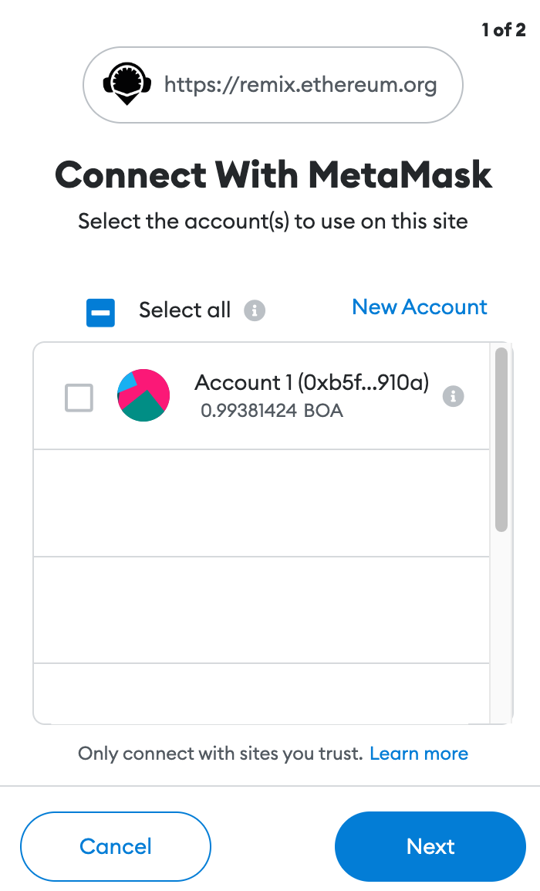
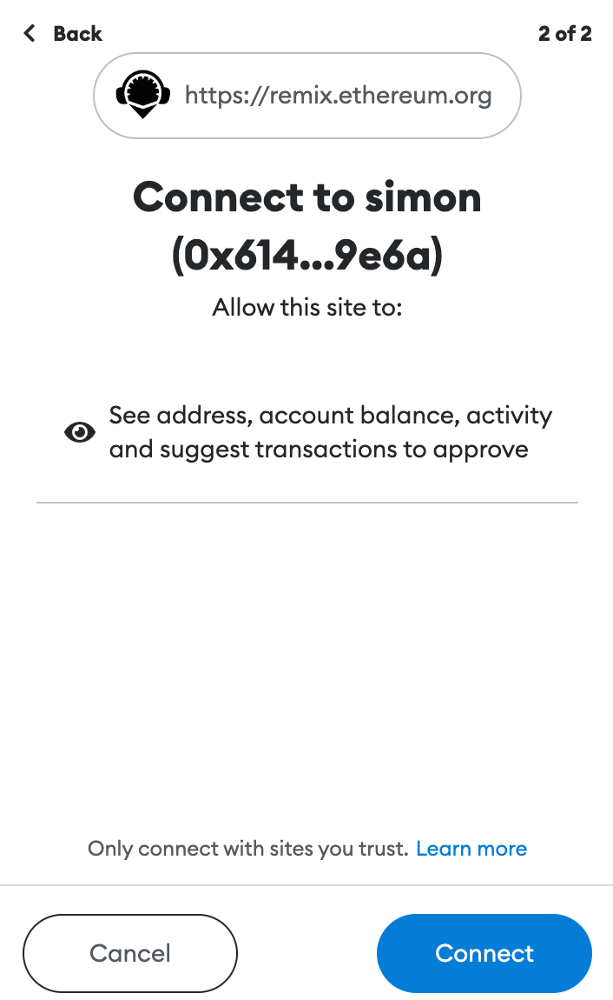

# Using Remix

Deploys a ERC20 smart contract with a message, and renders it in the front-end. You can interact with the smart contract easily!

This dApp implements a "Hello World" style application that echoes a message passed to the contract to the front end. 
This tutorial is intended to be followed using the online IDE available at [Remix IDE](https://remix.ethereum.org/).

### Setting Up [Remix IDE](https://remix.ethereum.org/)

- Remix is an online IDE to develop smart contracts.
- You need to choose Solidity Compiler and Deploy and Run Transactions.
- Go to File Explorers, And Create a new file, Name it ERC20Token.sol
- Copy/Paste the Smart contract below into the newly created file `ERC20Token.sol`

## Writing the Smart Contract

- Create new contract ERC20Token.sol and copy contract code from the ERC20 token template [here](../ERC20Token.template)

- Modify "TOKEN_NAME", "TOKEN_SYMBOL", "DECIMALS" and "TOTAL_SUPPLY" according to your requirements.

{style="width:80%;border:solid 1px;margin-left:30px"}

The first line, `pragma solidity ^0.8.0` specifies that the source code is for a Solidity version greater than 0.5.16. [Pragmas](https://solidity.readthedocs.io/en/latest/layout-of-source-files.html#pragma) are common instructions for compilers about how to treat the source code (e.g., pragma once).

A contract in the sense of Solidity is a collection of code (its functions) and data (its state) that resides at a specific address on the Ethereum blockchain. Learn more about the [constructor](https://solidity.readthedocs.io/en/latest/contracts.html#constructor) and  [memory](https://solidity.readthedocs.io/en/latest/introduction-to-smart-contracts.html#storage-memory-and-the-stack) in the docs.

## Compile Smart Contract

- Step1: Click button to switch to compile page

- Step2: Select "ERC20Token" contract

- Step3: Enable "Auto compile" and "optimization"

-  Step4: Click "ABI" to copy the contract abi and save it.

## Deploy Smart Contract

Now, We have to deploy our smart contract on BizNet Network. For that, we have to connect to web3 world, 
We will be using Metamask. Please follow this [tutorial to setup a Metamask Account](../../wallet/tutorials/metamask.md).

- Copy your address from Metamask

- Head over to Faucet - https://faucet.bosagora.org/request/boa/your-address and request test BOA

- Now, let's Deploy the Smart Contract on BizNet Testnet
 
- Select "Injected Web3" in the ENVIRONMENT dropdown and your contract

{style="min-width:350px;width:50%;border:solid 1px;margin:-10px 0 0 30px"}

- Metamask accept the Connection Request!

{style="height:300px;border:solid 1px;margin-left:30px;margin-top:-10px"}{style="height:300px;border:solid 1px;margin-top:-10px"}

- From the CONTRACT dropdown menu, select the ERC20Token.sol you created earlier.

{style="min-width:350px;width:50%;border:solid 1px;margin-left:30px;margin-top:-10px"}

- Click the Deploy button in Remix and accept another metamask popup that requires transaction confirmation once connected!

**Congratulations!** You have successfully deployed a ERC20 Contract. Now you can interact with the Smart Contract. Check the deployment status here: <https://testnet-scan.bosagora.org/>

