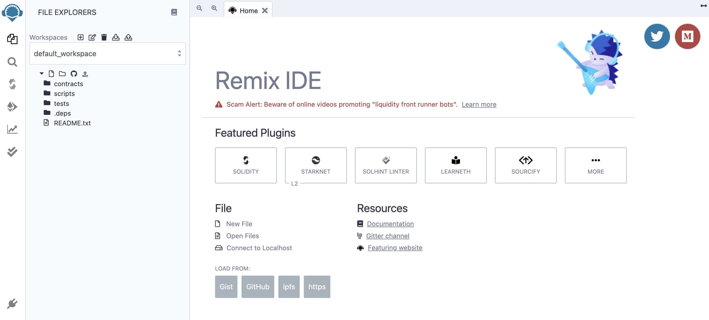
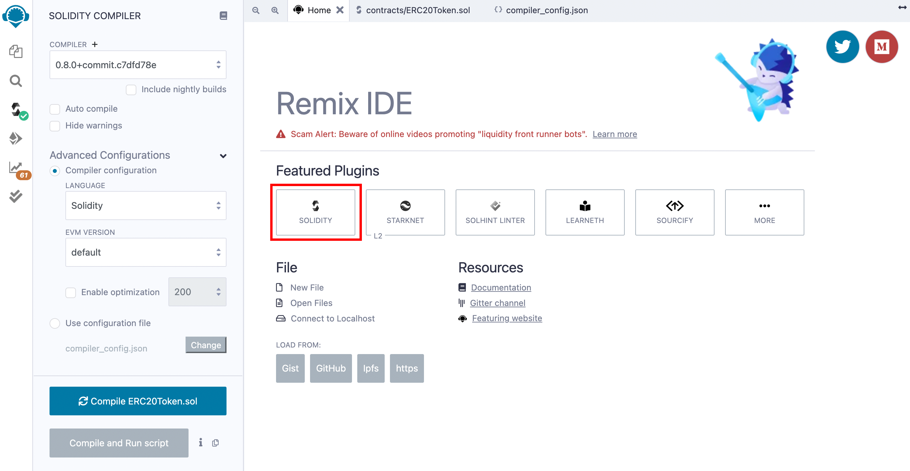
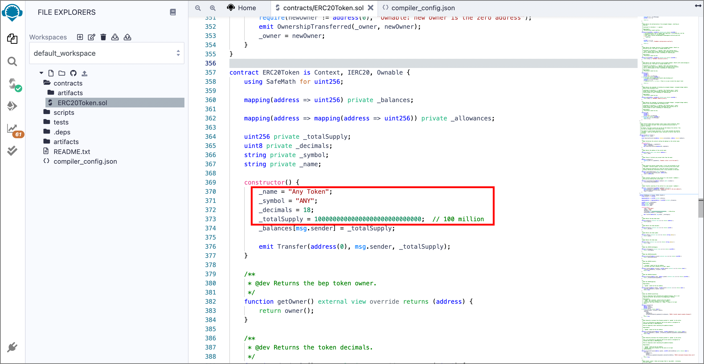
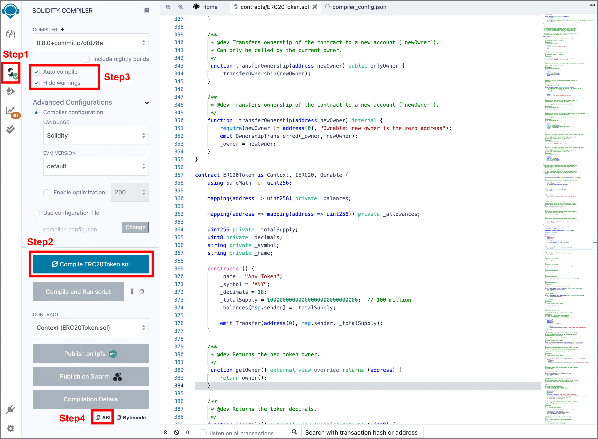
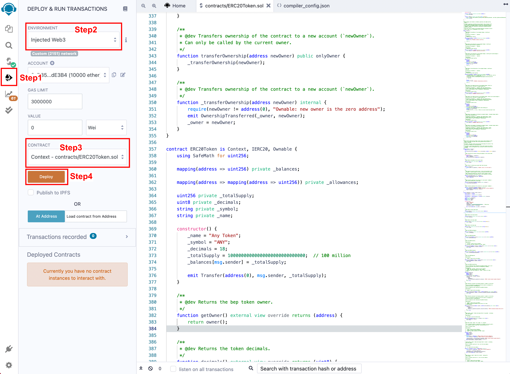
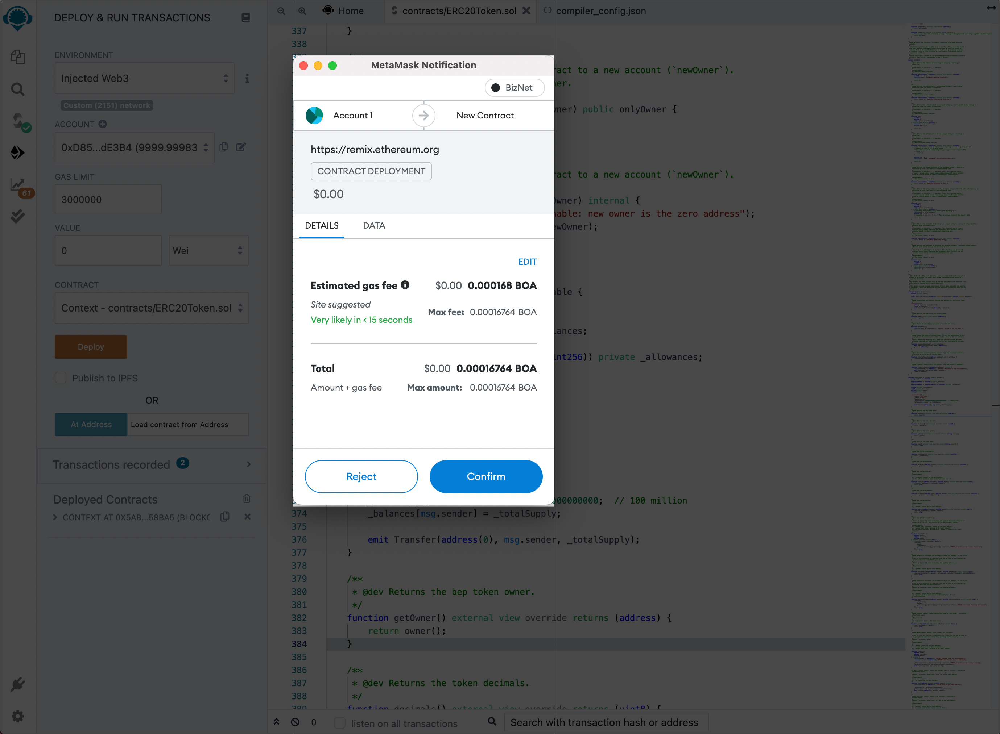

# Issue ERC20 Tokens

## **Compile and Deploy ERC20 Contract**  

1.Open Remix IDE: [https://remix.ethereum.org](https://remix.ethereum.org/)

2.Select solidity language

3.Create new contract ERC20Token.sol and copy contract code from the ERC20 token template [here](../ERC20Token.template)

4.Modify "name", "symbol", "decimals" and "totalSupply" according to your requirements.

5.Compile the ERC20 token contract

Step1: Click button to switch to compile page

Step2: Select "ERC20Token" contract  

Step3: Enable "Auto compile" and "optimization"  

Step4: Click "ABI" to copy the contract abi and save it.  

6.Deploy the contract to BizNet  

Step1: Click button to switch to compile button.  

Step2: Select "Injected Web3"  

Step3: Select "ERC20Token"  

Step4: Client "Deploy" button and Metamask will pop up  

Step5: Client "confirm" button to sign and broadcast transaction to BizNet.

