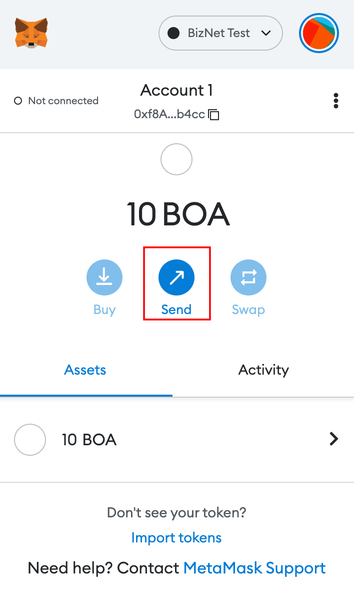
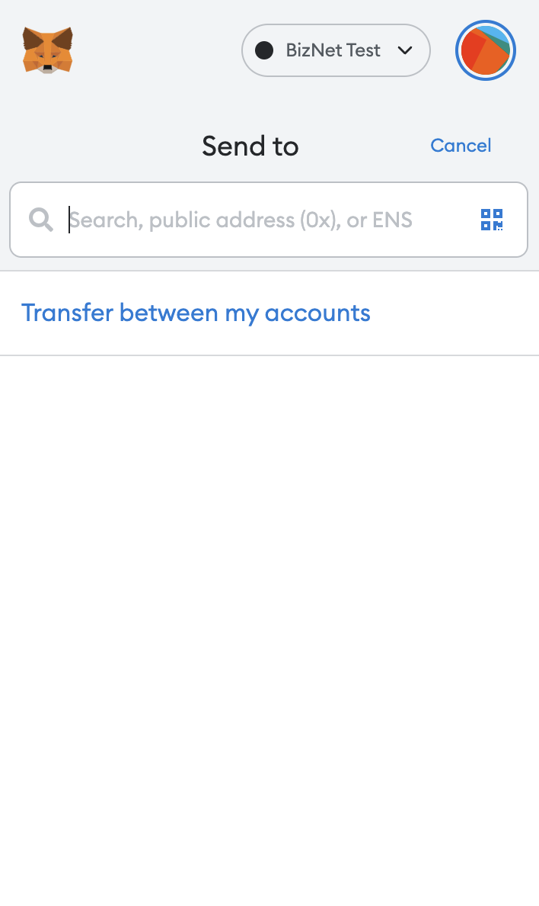
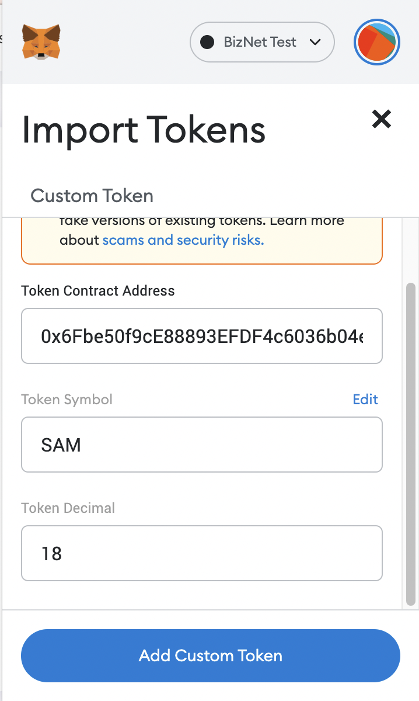
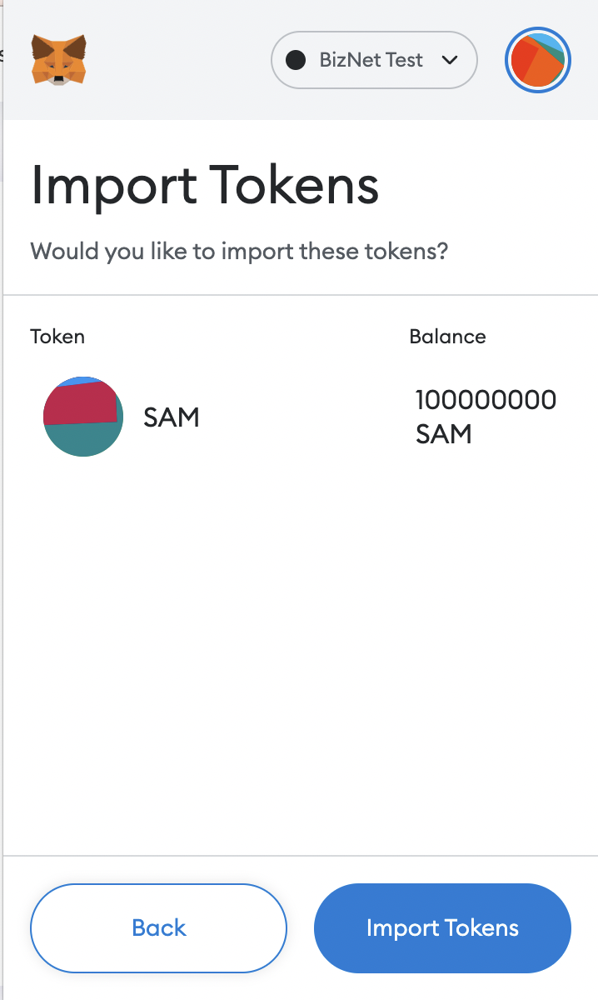
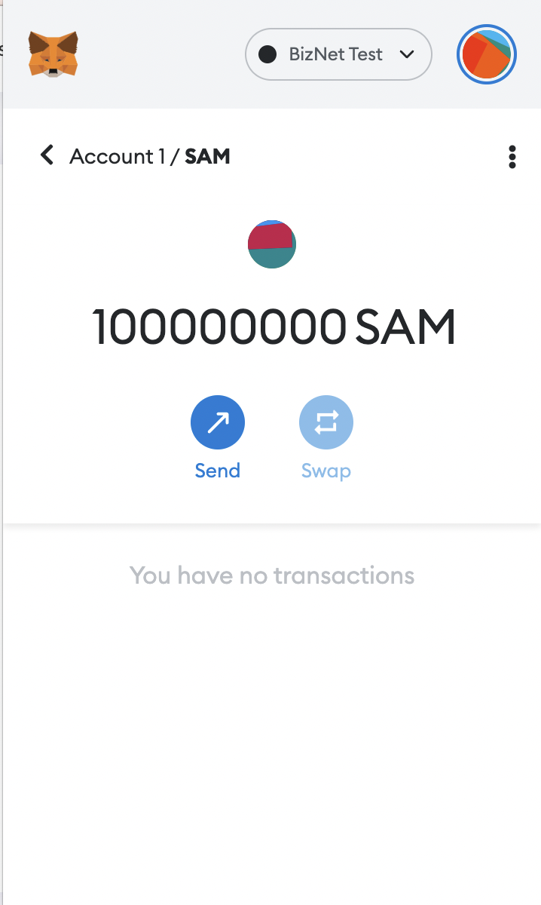
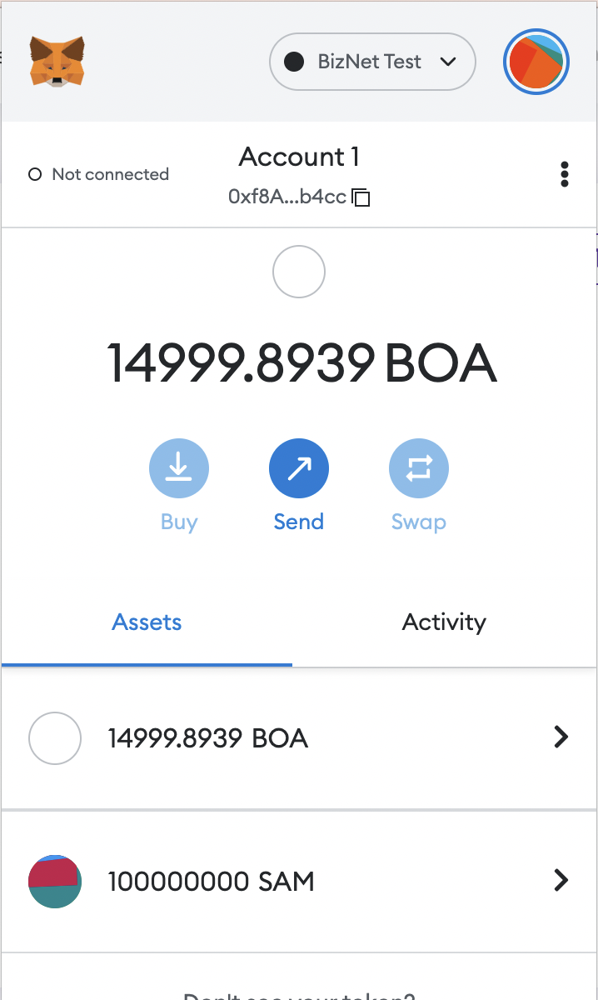
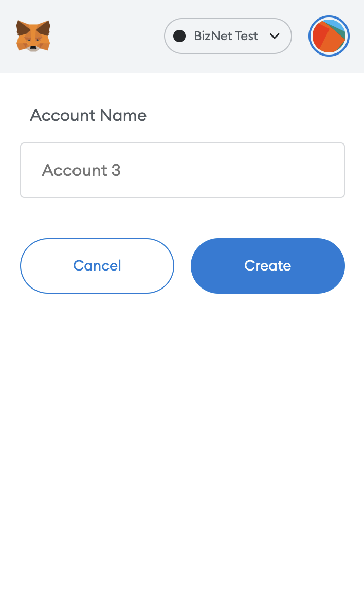
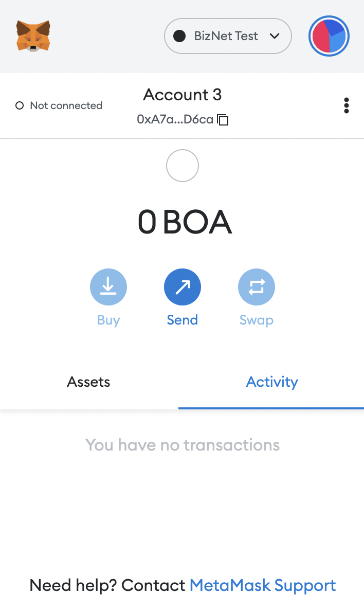

# Use MetaMask For BizNet

**Tip**  
If you encounter any network configuration issues in MetaMask, please make sure you have the latest version running.

## What is it?

MetaMask was created out of the needs of creating more secure and usable Ethereum-based web sites. In particular, it handles account management and connecting the user to the blockchain.
It’s supported in Chrome, Chrome, and Safari browsers.
## Install

**Example: Install MetaMask in Chrome browser**

* Open Extension Category in Chrome: https://chrome.google.com/webstore/category/extensionsSearch for MetaMask

**warning**   
Note: Make sure it’s offered by metamask.io

* Click on "Add to Chrome"

That’s it! You have successfully installed MetaMask extension in Chrome!

**Tip**  
The workflow is the same for all browsers

## Create an account in MetaMask for BizNet

1. Click on the "Create a wallet" button

2. Create Password of at least 8 characters

3. Click on "Create" and then write down your backup phrase.

4. Select each phrase in order to make sure it is correct then click "Confirm".

Congratulations! you have creat your MetaMask account!

## Connect Your MetaMask With BizNet

1. Go to setting page

2. Add a new network

* Testnet
  * [RPC URLs](./../../develop/rpc.md)
  * ChainID: 0x7E3 (2019 in decimal)
  * Symbol: BOA
  * [Block Explorer](https://testnet-scan.bosagora.org)

* Mainnet
  * [RPC URLs](./../../develop/rpc.md)
  * ChainID: 0x867 (2151 in decimal)
  * Symbol: BOA
  * [Block Explorer](https://scan.bosagora.org)

3. Claim some testnet token to your account. Click on your address for copy

1. Go to faucet page: https://faucet.bosagora.org/request/boa/your-address

**Tip**  
Please note that you can only claim once every minute

After the transfer transaction is sent, you will see an increase of your balance

## Transfer BOA to other BizNet address

1. Log in to your MetaMask

2. Click on Send button

3. Copy the receiver’s address in the box

4. Input the amount

5. Confirm your transaction, then click Next

6. Click Confirm to send your transaction

7. Wait for your transaction to be included in the new block

8. Once your transaction is confirmed, check it on block explorer by clicking Details

9.  Click on your account to see "Details''

10. Verify your transaction in Explorer:

## Add ERC20 Tokens
1. Deploy an ERC20 contract at https://remix.ethereum.org/

2. You can create a new file or import a sample contract: <https://gist.github.com/dev-bosagora/5e06fc7357604f900c2d81e0f6f0ad75>

3. Connect your BizNet Account to Remix

4. Select "SampleToken" contract and compile

5. Deploy your compiled contract

6. Adjust Gas Fee for your contract, then confirm your deployed contract

7. You can see that there is a new creat contract transaction in block explorer

8. In MetaMask, Click on "Import Tokens"

9. Choose "Custom Token" and copy the contract address in the box

10.  Click on "Add Custom Tokens"

Then you can see change of your balance

## Create Multiple Accounts

1. To create multiple accounts, you click on Profile icon on MetaMask and then click on Create Account

2. You can then add an account name and click on Create.

3. Then you can see a new account is created!

