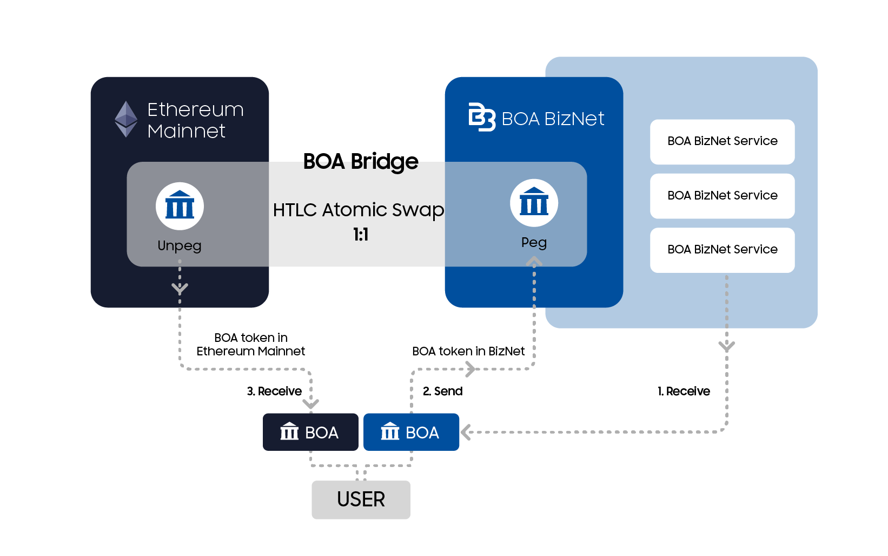

# Bridge

Bridge links them between Ethereum MainNet and BizNet's respective blockchain and mediates transactions.
Currently, BOA tokens are supported for coin transfer from Ethereum MainNet to BizNet, and this transaction is possible for two-way transactions (two-way pegging).
Performs a complete exchange with an atomic swap algorithm.

Ethereum MainNet ERC20 BOA and BizNet BOA exchange rates are 1BOA ≈ 1BOA.
In each network, the issuance is pegging and defagging, and the total coin issuance is fixed.

Bridge Process Flow Chart

Ethereum MainNet -> BOSAGORA BizNet

BOSAGORA BizNet -> Ethereum MainNet

