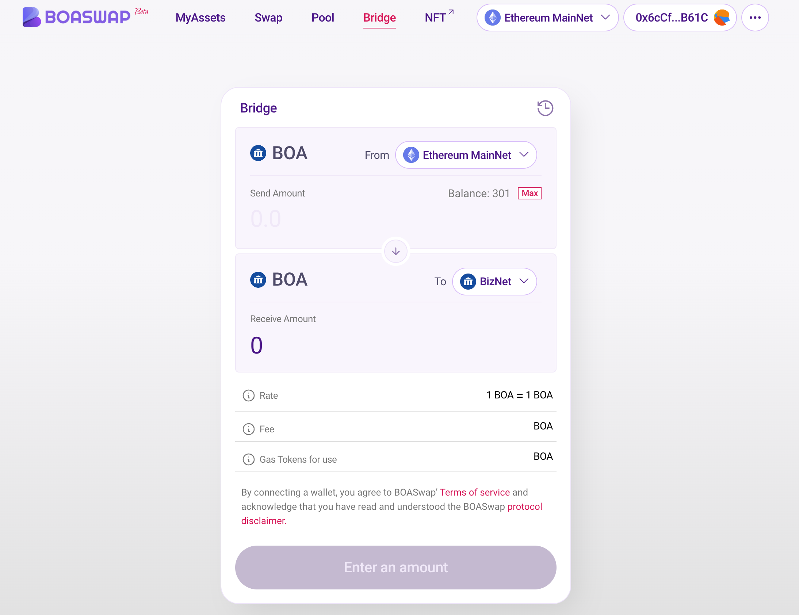
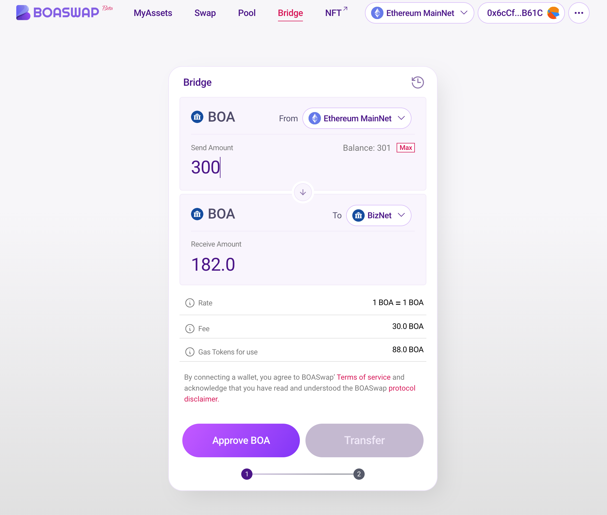
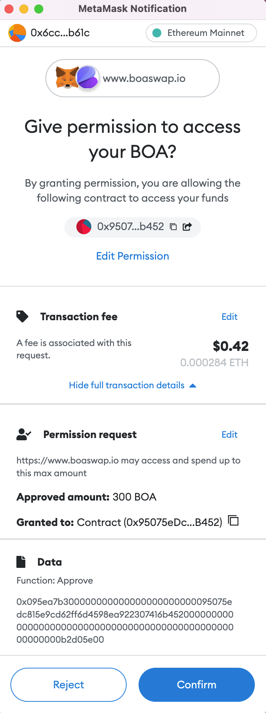
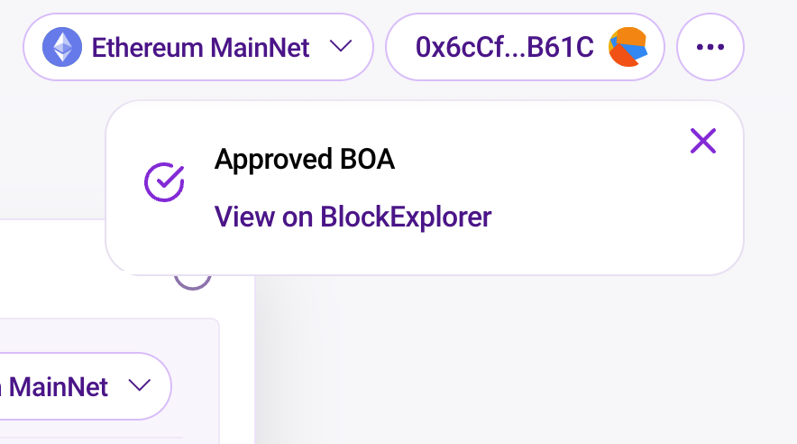
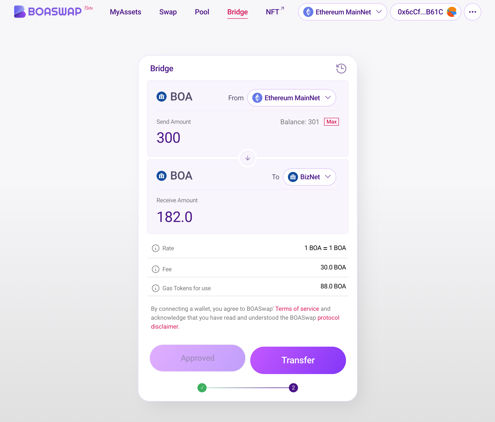
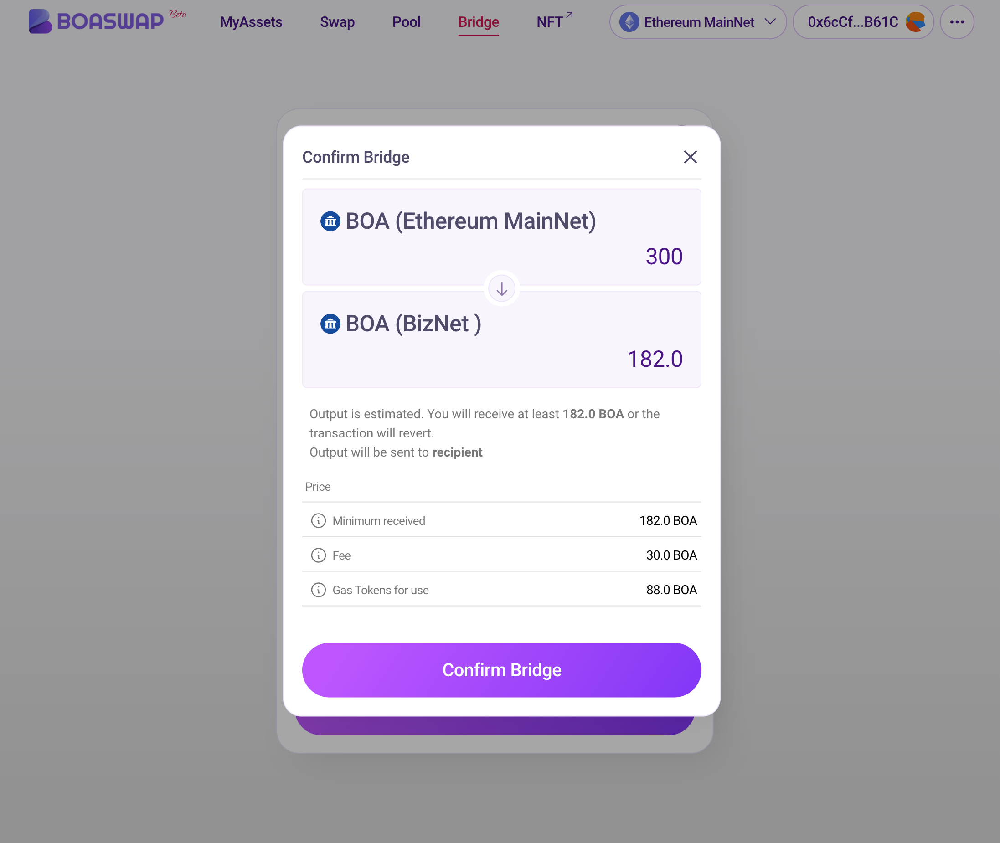
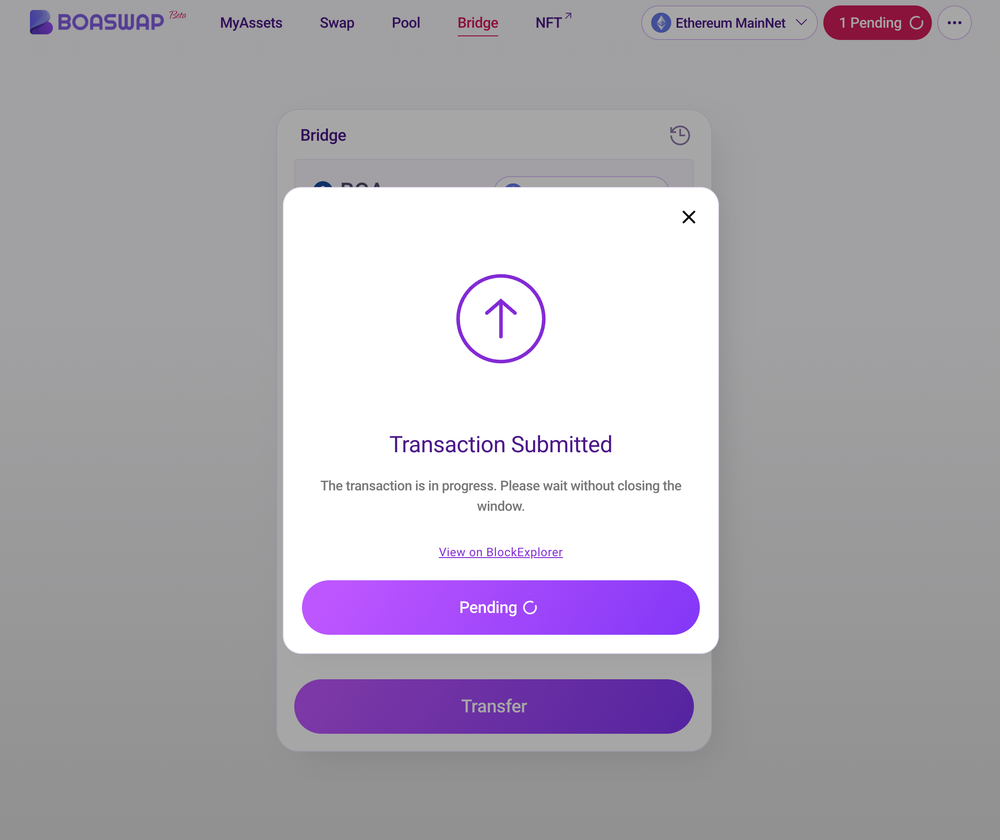
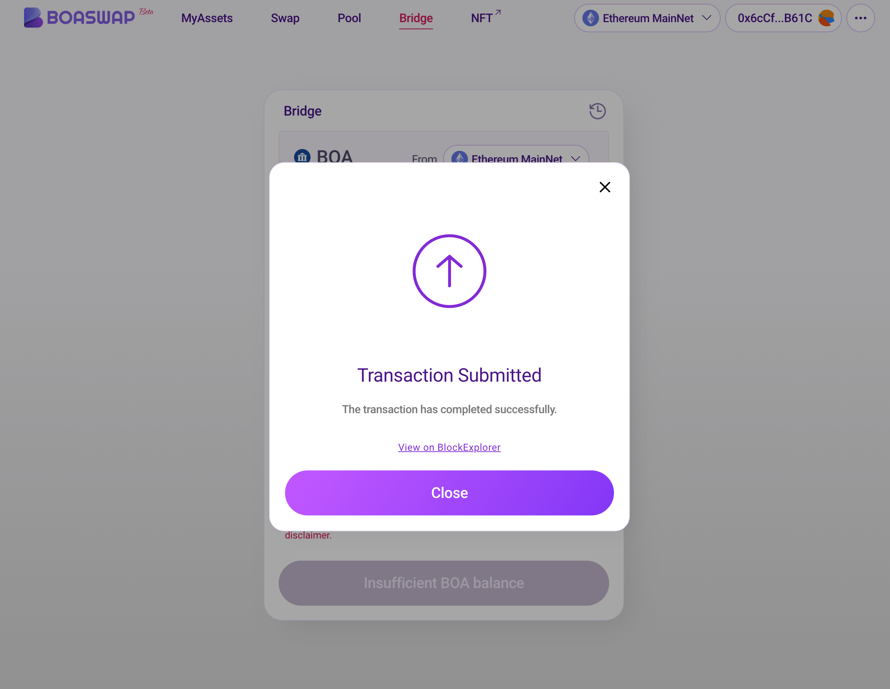
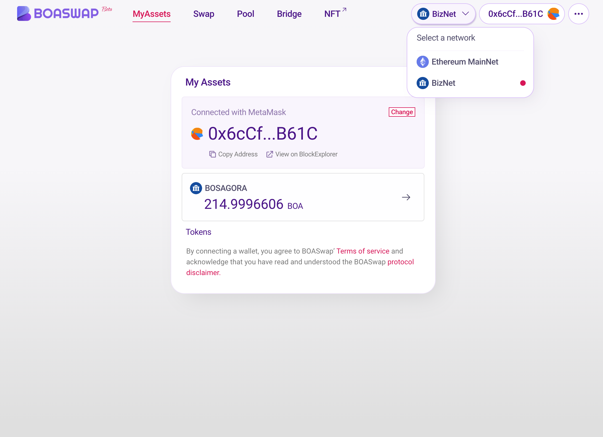

# How to use a Bridge

[BOASwap Bridge](https://testnet.boaswap.io/#/bridge)Connect to using a Chrome browser.

The MetaMask (Wallet) must be installed and connected before using the Bridge.
Since the bridge supports bidirectional transmission, It will first explain the scenario of transferring from Ethereum Mainnet ERC20 BOA to BOSAGORA BizNet BOA.

* Select the departure network first. In this case, select Ethereum Mainnet.
* The requirement is a small amount of gas ratio ETH and ERC20 BOA to be transmitted to Ethereum Mainnet.
* The bridge requires between 5 and 10 minutes to run. Do not close the browser while running the Bridge.

  

* From Confirm that network Ethreum Mainnet is selected, balance the ERC20 BOA, and enter the amount of BOA to be sent to BizNet network.
  The maximum input amount must be entered as much as the holding amount before transmission.

  ** Transfer amount - (Fee + Gas Tokens for use) = Amount received **

  Please note that the exchange rate is 1 BOA ≈ 1 BOA, but the fee will be deducted to measure the amount received by the arrival network because the Atomic swap algorithm generates gas costs in each network.

* Click Approve BOA to approve. This is to approve withdrawal from the smart contract.
  

* Click the "OK" button on the METAMASK for Approve.
  {style="min-width:350px;width:50%"}

* In BOASwap, when a transaction is confirmed, an Approved BOA message is displayed in the upper right corner.
  {style="min-width:350px;width:50%"}

* Click the "Transfer" button to transfer the BOA to the arrival network using the Bridge.
  

* Check the amount to be sent and the amount to be delivered, check the fee, and click the "Confirm Bridge" button.
  

* Click the "OK" button on the METAMASK to execute the Bridge Contract.
  

* "Transaction Submitted" Check the pop-up and wait for 5 to 10 minutes in the Pending state.

    ** Please do not move the browser address during the Pending state and wait. **

    ** BOASwap needs to generate and submit a secret key, check the Bridge relay node, and run the Bridge protocol. **
  

* If the Close button is visible, this process is complete. Click the "Close" button.
  

* Go to the MyAssets menu and change to BizNet network. Check if your BOSAGORA BOA has been deposited well.
  
 

