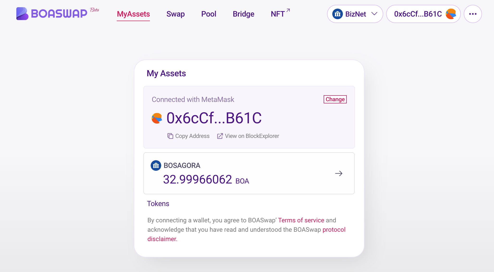

# My Assets

Displays the trusted token list and point holding balance in BOASwap.

The information displayed at the top shows the address of your wallet.
Token lists are displayed separately by network chain.
The Token List is listed here.
[https://github.com/bosagora/token-list](https://github.com/bosagora/token-list/blob/v0.x.x/src/tokens/tokens.json)

