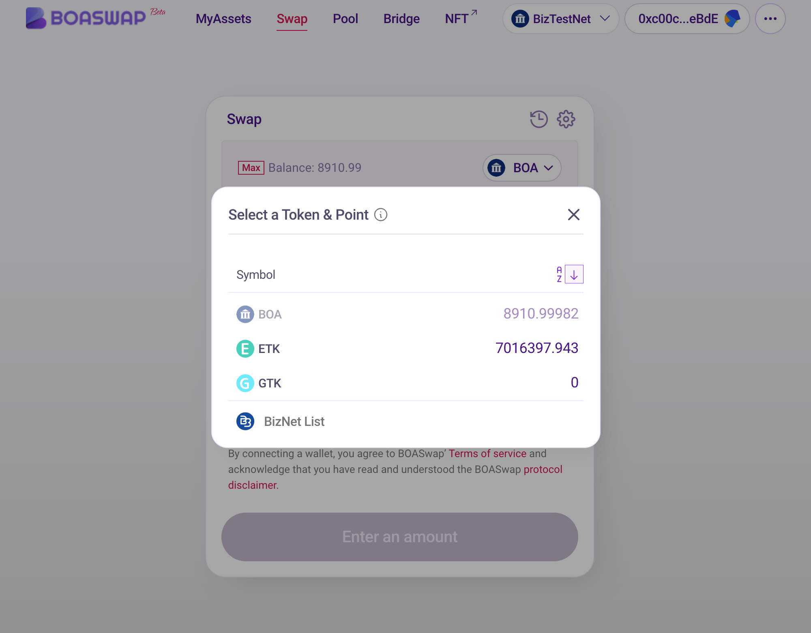
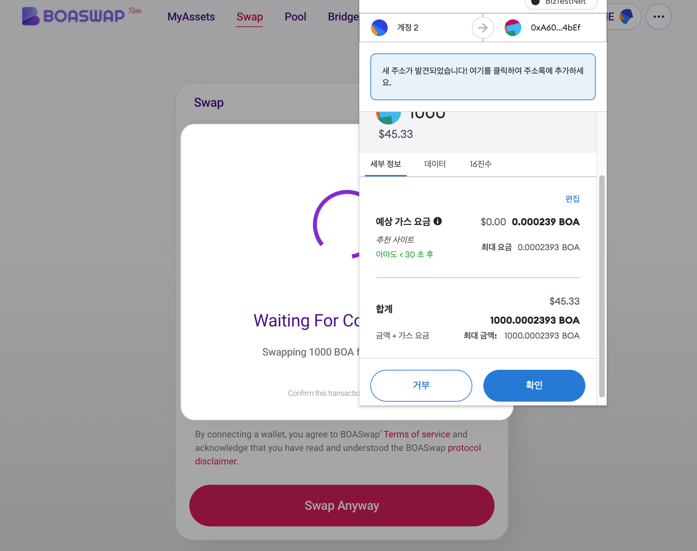
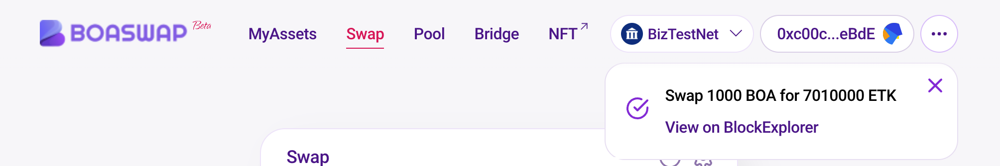

# How to use a Swap

[BOASwap Swap](https://testnet.boaswap.io/#/swap)Connect to using a Chrome browser.

Before using BOASwap, the MetaMask (Wallet) must be installed and connected.
Explain the scenario of exchanging a BOSAGORA BizNet BOA for a demo token (ETK) in BOASwap.
The current screenshot image is the situation of BizTestNet. The actual run must be run on BizNet.

* First, verify that the network is selected as BizNet and connected.
* The requirement is BOA from BizNet.
* The process is similar to the experience of using UNISwap.

* First, select the token that you want to exchange.
* Whether tokens are interchangeable or not can be different for each token and point. Non-exchangeable tokens are deactivated.
  

* Enter the amount to be exchanged. If you enter the input token amount amount at the top, the amount of tokens you will receive is determined by the liquidity price curve of the BOASwap DEX Protocol.
* The fee is measured at 1.5%, which is the sum of the liquidity provider fee and the protocol fee.
* Approve runs when swapping, and a small amount of network gas cost is required for swapping.

* The settings pop-up lets you set up Slippage Tolerance and Transaction Deadline.
* Slippage Tolerance represents the difference between the expected output and the actual output at the time the transaction was executed. If the price changes above the set slipage limit, the transaction will be canceled.
* Transaction deadline sets the default transaction closing to 20 minutes to prevent users from executing transactions at bad prices after significant price changes.
* If the gas price is not set high enough, the transaction may reach deadline.

* Check the transaction details again. Please check the amount of tokens to be exchanged.
* Price Impact indicates the impact of this transaction on the market price of the transaction pair.
* Once confirmed, click "Swap Anyway" to execute the swap.

* Check the gas bill for the swap transaction in the wallet and press the "OK" button to transfer the transaction.

* Your transaction has been submitted. Click "Close" to close the pop-up.

* You can check the swap results with a message in the upper right corner.

* You can check the token balance of the target you swapped from the My Assets menu.

