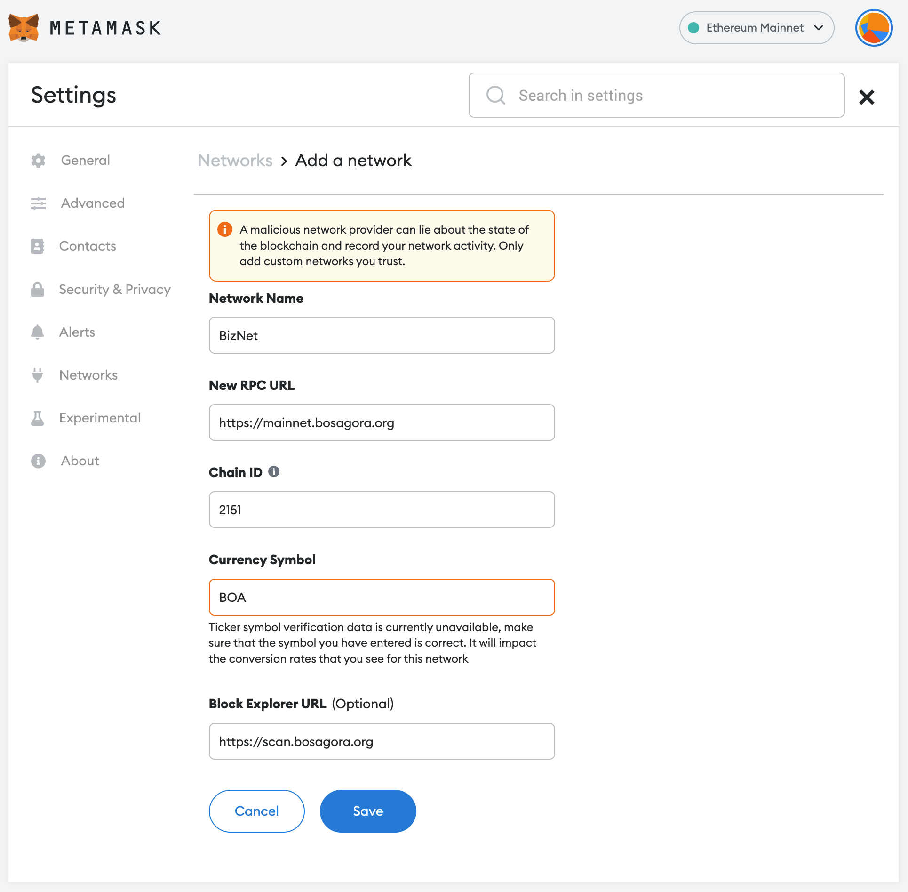

# Connecting to a Wallet

[BOASwap Interfaces](https://boaswap.io) provides a UI to easily use BOASwap
BOASwap supports MetaMask Wallet by default.
MetaMask currently supports Chrome, Firefox, Edge, and more.
BOASwap requires an extension plug-in installed in your PC browser by default.
An upgrade is in progress for the current version to be available on the mobile web.

- You must add a BizNet network to the Metamask. You can add a network manually by pressing the Add Network button, or you can add it by automatically approving it as an add network notification in BOASwap.

** When adding an automatic network **

- Click Connect to a wallet to connect your wallet.

{style="min-width:350px;width:50%"}

- Click the Approve button.

{style="min-width:350px;width:50%"}

- Click the Switch network button.

{style="min-width:350px;width:50%"}

** About adding a manual network **

* Network Name : BizNet
* New RPC URL : https://mainnet.bosagora.org
* Chain ID : 2151
* Currency Symbol : BOA
* Block Explorer URL(Optional) : https://scan.bosagora.org

- The Metamask Wallet connects to BOASwap and the network connects to BizNet.

