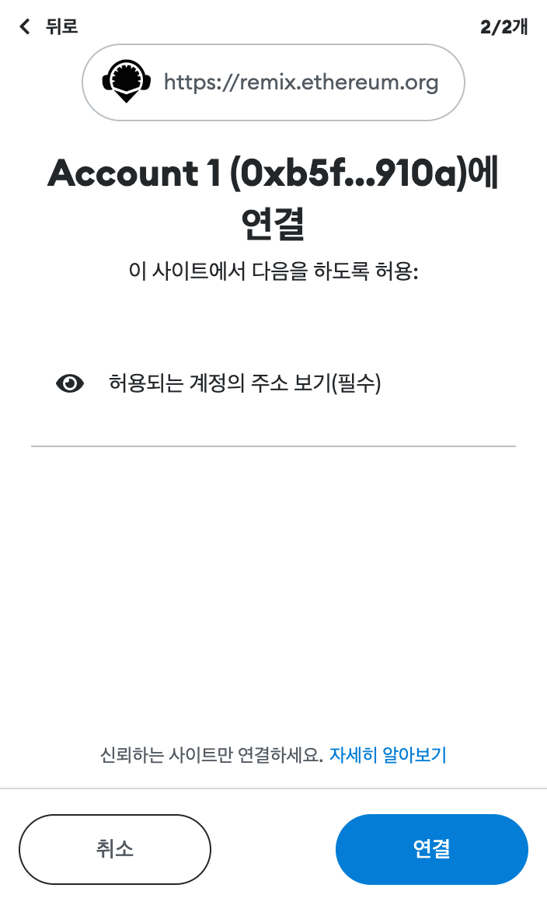
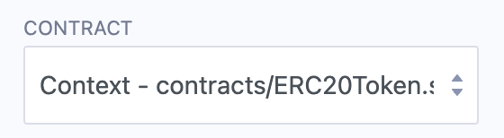

# **Remix 사용하기**

메시지와 함께 ERC20 스마트 계약을 배포하고 프런트 엔드에서 렌더링합니다. 스마트 계약과 쉽게 상호 작용할 수 있습니다!

이 dApp은 계약에 전달된 메시지를 프런트 엔드로 표시하는 "Hello World" 스타일 애플리케이션을 구현합니다. 
이 튜토리얼은 [Remix IDE](https://remix.ethereum.org/) 에서 사용할 수 있는 온라인 IDE를 사용하기 위한 것 입니다.

## **[Remix IDE](https://remix.ethereum.org/) 설정하기**

 - Remix는 스마트 계약을 개발하기 위한 온라인 IDE입니다.
 - Solidity Compiler 및 Deploy and Run Transactions를 선택해야 합니다.
 - 파일 탐색기로 이동하여 새 파일을 만들고 이름을 ERC20Token.sol로 지정합니다.
 - 새로 생성된 파일(ERC20Token.sol) 에 아래의 스마트 계약을 템플릿 내용 복사/붙여넣기 

## **스마트 컨트랙트 작성하기**

- [여기](../ERC20Token.template) 에서 ERC20 토큰 템플릿의 스마트컨트랙트 코드를 복사 합니다.
- 요구 사항에 따라 "TOKEN_NAME", "TOKEN_SYMBOL", "DECIMALS" 및 "TOTAL_SUPPLY"를 수정합니다.

{style="width:80%;border:solid 1px;margin-left:30px"}

- 첫 번째 줄 `pragma solidity ^0.8.0`은 소스 코드가 0.8.0 이상의 Solidity 버전용임을 지정합니다.
[Pragmas](https://solidity.readthedocs.io/en/latest/layout-of-source-files.html#pragma) 는 소스 코드를 처리하는 방법에 대한 컴파일러의 일반적인 지침입니다(예: pragma once).

Solidity에서 계약은 이더리움 블록체인의 특정 주소에 있는 코드(기능)와 데이터(상태)의 모음입니다. 
문서에서 [constructor](https://solidity.readthedocs.io/en/latest/contracts.html#constructor) 와 [memory](https://solidity.readthedocs.io/en/latest/introduction-to-smart-contracts.html#storage-memory-and-the-stack) 에 대해 자세히 알아보세요 .

## **스마트 컨트랙트 컴파일**

- 1단계: 버튼을 클릭하여 컴파일 페이지로 전환

- 2단계: "ERC20Token" 컨트랙트 선택

- 3단계: "자동 컴파일" 및 "최적화" 활성화

- 4단계: "ABI"를 클릭하여 계약서를 복사하고 저장합니다.

## **스마트 컨트랙트 배포**

이제 BizNet에 스마트 계약을 배포해야 합니다. 이를 위해 우리는 web3 세계에 연결해야 합니다. 이것을 위해서 우리는 메타마스크를 사용할 것입니다. 이 [튜토리얼을 따라 메타마스크 설정을 완료 하세요](../../wallet/tutorials/metamask.md).

- 메타마스크에서 주소를 복사

- 수도꼭지를 호출하여 테스트넷의 BOA 요청 
https://faucet.bosagora.org/request/boa/:your_address 

- 이제 BizNet 테스트넷에 스마트 계약을 배포해 보겠습니다.
- Remix 의 환경설정 드롭다운 메뉴에서 Injected Web3를 선택합니다.

{style="min-width:350px;width:50%;border:solid 1px;margin:-10px 0 0 30px"}

- 메타마스크에서 연결 요청을 수락합니다.

{style="height:300px;border:solid 1px;margin-left:30px;margin-top:-10px"}{style="height:300px;border:solid 1px;margin-top:-10px"}

- CONTRACT 드롭다운 메뉴에서 이전에 생성한 ERC20Token.sol 을 선택합니다.

{style="min-width:350px;width:50%;border:solid 1px;margin-left:30px;margin-top:-10px"}

- Remix 에서 Deploy 버튼을 누르고 연결되면 트랜잭션 확인이 필요한 또 다른 메타마스크 팝업을 수락하십시오!

**축하합니다!** 
ERC20 계약을 성공적으로 배포했습니다. 이제 스마트 계약과 상호 작용할 수 있습니다. 여기에서 배포 상태를 확인하십시오: <https://testnet-scan.bosagora.org/>

