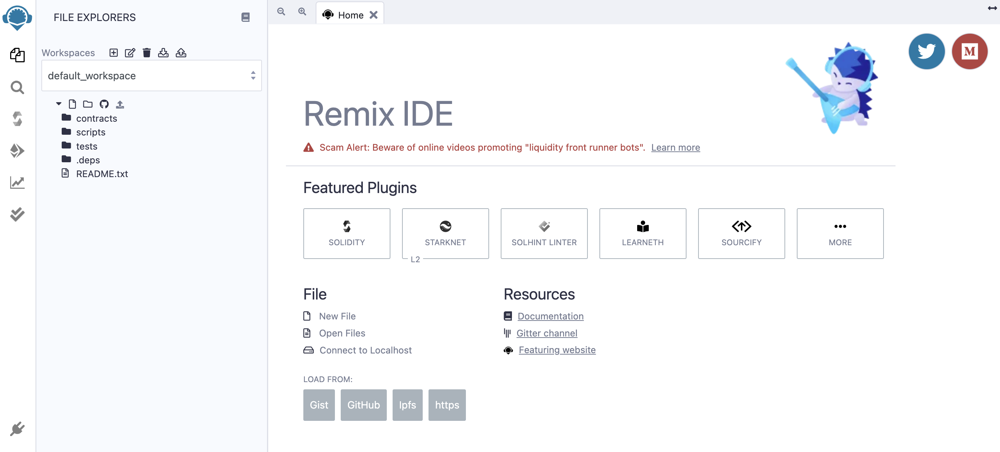

# **ERC20 토큰 발행**

## **ERC20 컨트랙트의 컴파일 및 배포**

### 1. REMIX IDE 열기

URL : [https://remix.ethereum.org](https://remix.ethereum.org/)

### 2. 솔리디티 언어 선택

### 3. 코드복사

[여기](../ERC20Token.template) 에서 새로운 컨트랙트 ERC20Token.sol을 만들고 ERC20 토큰 템플릿에서 컨트랙트 코드를 복사 합니다.

### 4. 코드수정

요구 사항에 따라 "name", "symbol", "decimals" 및 "totalSupply"를 수정합니다.

### 5. ERC20 토큰 컨트랙트를 컴파일

1단계: 버튼을 클릭하여 컴파일 페이지로 전환합니다.

2단계: "ERC20Token" 컨트랙트 선택합니다.

3 단계: "자동 컴파일" 및 "최적화" 활성화합니다.

4단계: "ABI"를 클릭하여 컨트랙트서를 복사하고 저장합니다.

### 6. BizNet에 컨트랙트를 배포

1단계: 버튼을 클릭하여 컴파일 버튼으로 전환합니다. 

2단계: "Injected Web3" 선택합니다.

3단계: "ERC20Token" 선택합니다.

4단계: 클라이언트 "배포" 버튼을 클릭하면 메타마스크가 팝업됩니다.

5단계: 클라이언트 "Confirm" 버튼을 눌러 서명하고 BizNet에 트랜잭션을 전송합니다.

