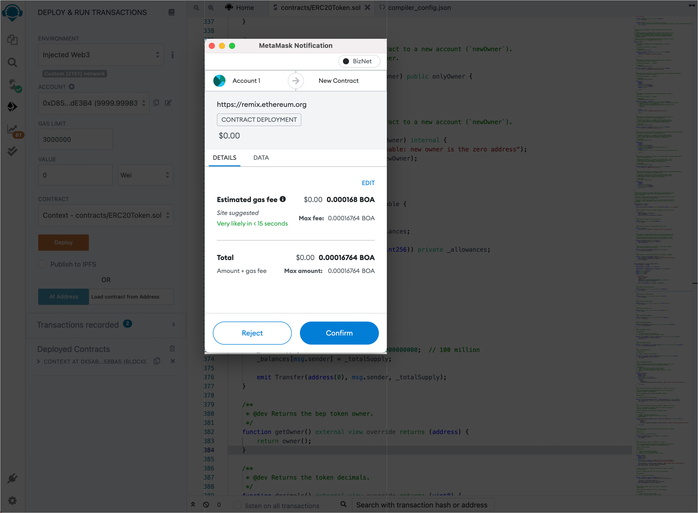

# ERC20 토큰 발행

## **ERC20 계약 컴파일 및 배포t**

1. REMIX IDE 열기: [https://remix.ethereum.org](https://remix.ethereum.org/)
   

2. 솔리디티 언어 선택
   

3. [여기](../ERC20Token.template) 에서 새 계약 ERC20Token.sol을 만들고 ERC20 토큰 템플릿에서 계약 코드를 복사 합니다.

4. 요구 사항에 따라 "name", "symbol", "decimals" 및 "totalSupply"를 수정합니다.
   

5. ERC20 토큰 계약을 컴파일합니다  
   a. 1단계: 버튼을 클릭하여 컴파일 페이지로 전환
   b. 2단계: "ERC20Token" 계약 선택
   c. 3 단계: "자동 컴파일" 및 "최적화" 활성화
   d. 4단계: "ABI"를 클릭하여 계약서를 복사하고 저장합니다.
   

6. BizNet에 계약 배포
   a. 1단계: 버튼을 클릭하여 컴파일 버튼으로 전환합니다. 
   b. 2단계: "Injected Web3" 선택
   c. 3단계: "ERC20Token" 선택  
   d. 4단계: 클라이언트 "배포" 버튼과 메타마스크 팝업p  
   
   e. 클라이언트 "Confirm" 버튼을 눌러 서명하고 BizNet에 트랜잭션을 브로드캐스트합니다.
   
