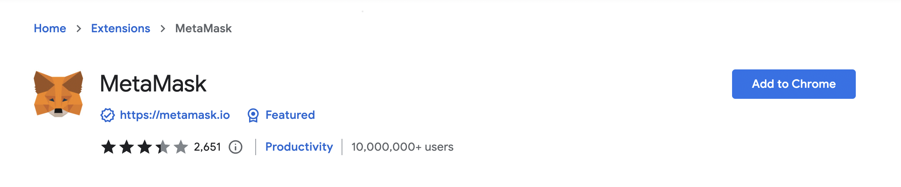
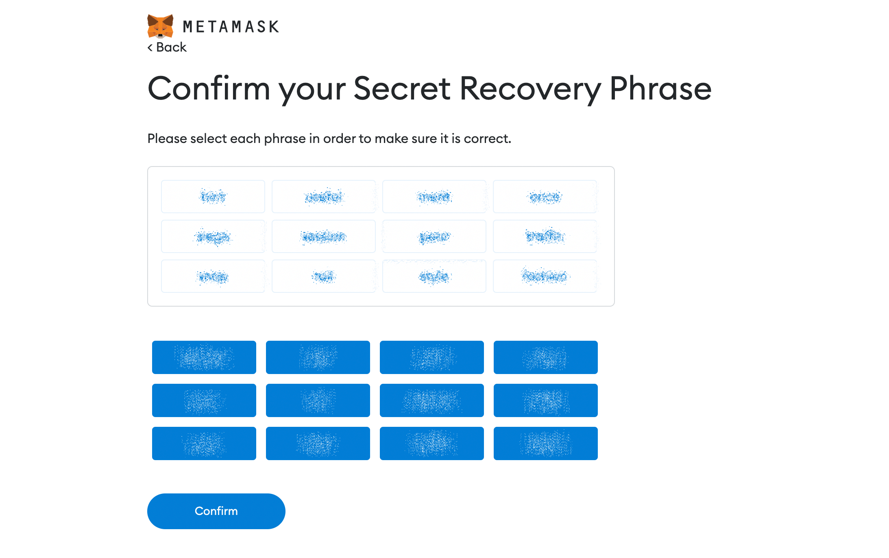
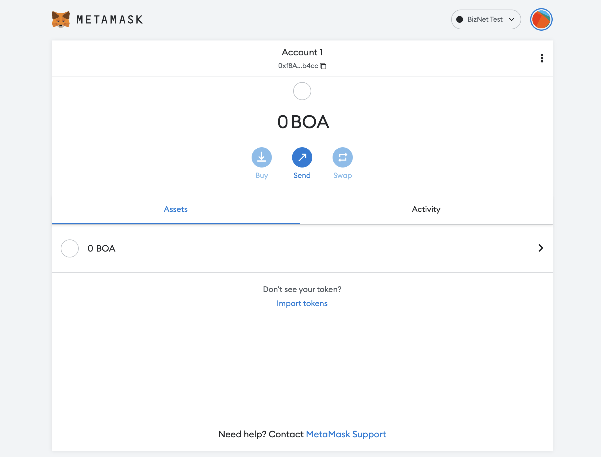

# **메타마스크 사용하기**

**팁**  
메타마스크에서 네트워크 구성 문제가 발생하는 경우 최신 버전이 실행 중인지 확인하십시오.

## **메타마스크란?**

메타마스크는 더 안전하고 사용 가능한 이더리움 기반 웹사이트를 만들어야 한다는 필요성 때문에 만들어졌습니다. 
특히 계정들의 관리와 사용자의 계정을 블록체인에 연결하는 작업을 처리합니다.
이것은 크롬과 사파리 브라우저에서 지원됩니다.

## **설치하는 방법**

**예: Chrome 브라우저에 MetaMask 설치**

* Chrome 웹 스토어 MetaMask: [https://chrome.google.com/webstore/detail/metamask/nkbihfbeogaeaoehlefnkodbefgpgknn](https://chrome.google.com/webstore/detail/metamask/nkbihfbeogaeaoehlefnkodbefgpgknn)

**경고**   
주의: `metamask.io` 에서 제공되는 것인지 확인하세요

* "Chrome에 추가" 버튼을 클릭합니다.

그러면 크롬 브라우즈에 설치가 완료됩니다.

**팁**  
워크플로는 모든 브라우저에서 동일합니다.

## **계정을 생성하는 방법**

1."지갑 생성" 버튼를 클릭합니다.

2.8자 이상의 암호를 기록하고, 이용약관에 동의한 후, "생성" 버튼을 클릭합니다.

3.비밀 복구 구문을 백업한 후 "다음" 버튼을 클릭합니다.

* 비밀 복구 구문 백업 방법중에 종이 와 펜을 이용해서 작성후 별도의 공간에 잘 보관 하시길 바랍니다.  

4.각 구문을 선택하여 올바른지 확인한 후 "확인"을 클릭합니다.

축하합니다! 메타마스크 계정을 생성했습니다!

## **BizNet에 연결하는 방법**

1."설정" 페이지로 이동합니다.

* 또는 "이더리움 메인넷"으로 표시 되어있는 네트워크 선택 버튼을 클릭 합니다.

2."네트워크 추가"를 선택합니다.

* 메인넷
      * [RPC URL](./../../develop/rpc.md): https://mainnet.bosagora.org  
      * 체인 ID: 2151 (0x867)
      * 통화기호: BOA
      * [블록탐색기 URL](https://scan.bosagora.org): https://scan.bosagora.org

* 테스트넷
      * [RPC URL](./../../develop/rpc.md): https://testnet.bosagora.org
      * 체인 ID: 2019 (0x7E3)
      * 통화기호: BOA
      * [블록탐색기 URL](https://testnet-scan.bosagora.org): https://testnet-scan.bosagora.org

## **BOA를 전송하는 방법**

1.MetaMask에 로그인합니다.

2."보내기" 버튼을 클릭합니다.

3.수신자의 주소를 입력합니다.

4.전송할 금액을 입력합니다.

5.거래를 확인하고 "다음" 버튼을 클릭합니다.

6.트랜잭션을 보내려면 "확인"을 클릭하십시오.

7.트랜잭션이 새 블록에 포함될 때까지 기다리십시오.

8.거래가 확인되면 블록 탐색기에서 세부 정보를 클릭하여 확인합니다.

9.계정을 클릭하여 "세부 정보"를 확인하십시오.

10.블록탐색기에서 트랜잭션을 확인합니다.

## **ERC20 토큰 추가하기**

1.MetaMask에서 "토큰 가져오기"를 클릭합니다.

2.맞춤형토큰을 선택하고 상자에 컨트랙트 주소를 복사합니다.

3."토큰 가져오기" 버튼을를 클릭합니다.

4.그러면 당신은 당신의 잔고를 볼 수 있다.

## **여러개의 계정 만드는 방법**

1.계정을 여러 개 만들려면 메타마스크의 Profile 아이콘을 클릭한 다음 "계정 생성" 메뉴를 클릭합니다.

2.그런 다음 계정 이름을 추가하고 "생성" 버튼을 클릭합니다.

3.그러면 새 계정이 생성된 것을 볼 수 있습니다!

