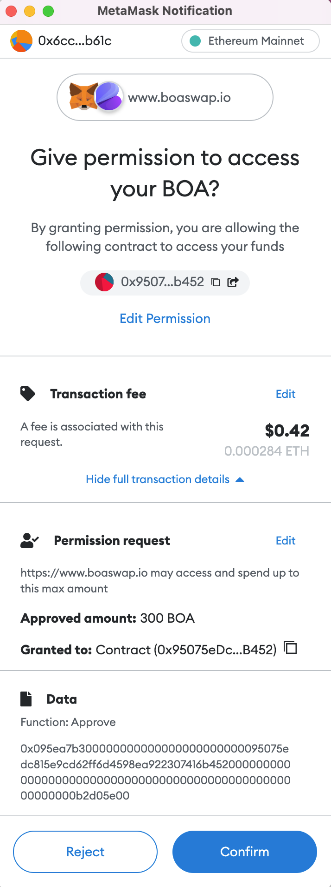
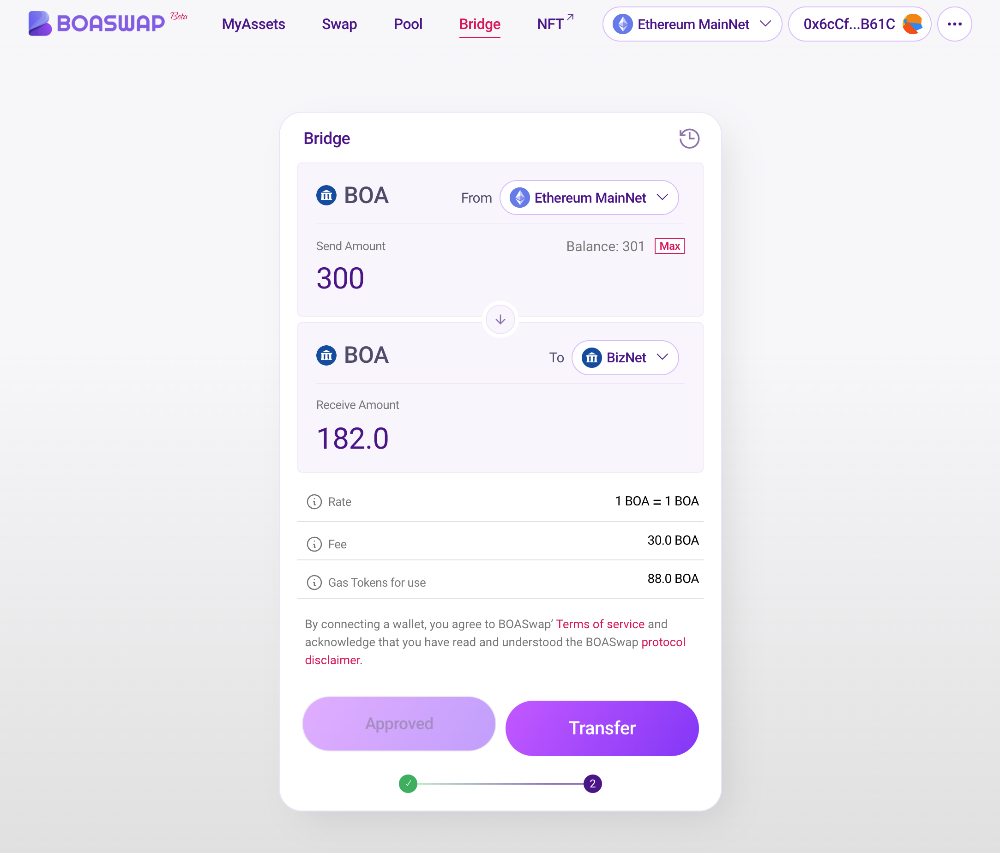
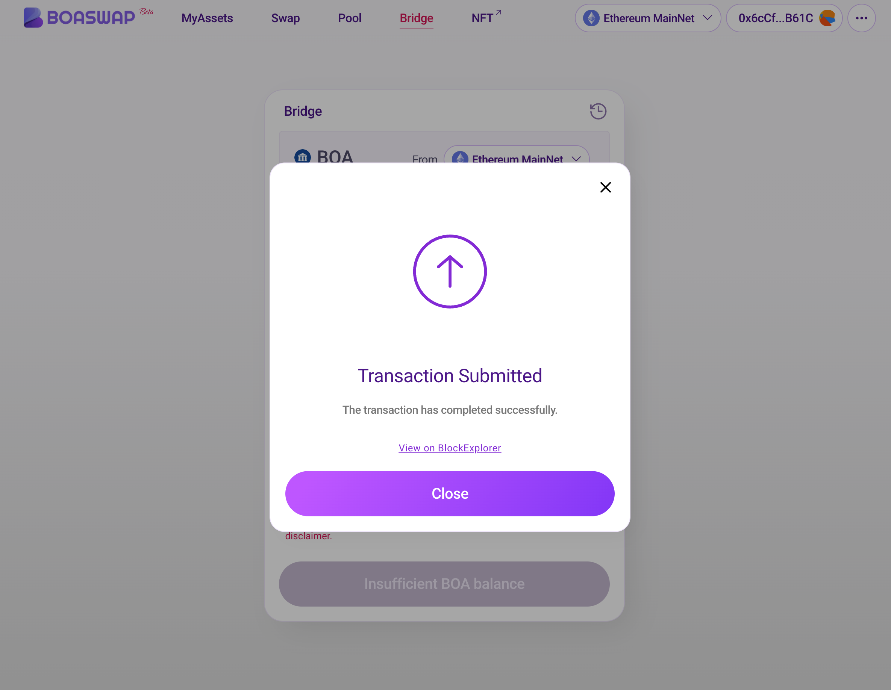

# 브릿지 사용하기

[BOASwap Bridge](https://testnet.boaswap.io/#/bridge)에 크롬 브라우저를 이용해서 접속 합니다.

Bridge를 사용하기 전에 MetaMask(Wallet)가 설치 되어 연결 되어 있어야 합니다.
Bridge는 양방향 전송을 지원 하므로 먼저 Ethereum Mainnet ERC20 BOA 에서 BOSAGORA BizNet BOA로 전송하는 시나리오를 설명 하겠습니다.

* 먼저 출발 네트워크를 선택합니다. 이경우 Ethereum Mainnet을 선택 합니다.
* 필요사항은 Ethereum Mainnet에 소량의 가스비 ETH 와 전송할 ERC20 BOA 가 필요 합니다.
* Bridge 실행에는 5분 ~ 10분 정도의 시간이 필요 합니다. Bridge를 실행하는 동안 브라우저를 닫지 말아주세요. 

  

* From 네트워크 Ethreum Mainnet 이 선택된것을 확인하고 ERC20 BOA의 잔액을 하고 BizNet 네트워크로 전송할 BOA 수량을 입력 합니다.
최대 입력금액은 보유수량 만큼 입력해야 전송 할 수 있습니다.

    ** 전송금액 - (Fee(교환 수수료) + Gas Tokens for use(트랜잭션 가스비)) = 받는 금액 ** 

    아토믹스왑 알고리즘 으로 각각의 네트워크에서 가스비가 발생 되므로 환율은 1 BOA ≈ 1 BOA 이지만 수수료가 차감되어 도착 네트워크의 받는금액이 측정 되므로 이점을 주의해주시기 바랍니다.

* Approve BOA 를 클릭하여 승인 합니다. 이것은 스마트컨트랙 에서 출금 할 수 있도록 승인 하는 것 입니다.
  

* Approve를 하기위해 METAMASK에서 "확인" 버튼을 클릭 합니다.
  

* BOASwap 에서는 트랜잭션이 컨펌되면 우측상단에 Approved BOA 토스트 메세지가 표시 됩니다.
  

* Bridge를 이용해서 도착 네트워크로 BOA를 전송하기 위해 "Transfer" 버튼을 클릭 합니다.
  

* 전송할 금액 과 도착 금액을 확인 하고 수수료를 확인 하고 "Confirm Bridge" 버튼을 클릭 합니다.
  

* Bridge 컨트랙트를 실행하기 위해 METAMASK에서 "확인" 버튼을 클릭 합니다.
  

* "Transaction Submitted" 팝업을 확인하고 Pending 상태에서 5분 ~ 10분간 기다립니다.

    ** Pending 상태 동안 브라우저 주소를 이동하지 말고 기다려 주시기 바랍니다. **

    ** BOASwap은 비밀키를 생성하여 제출 해야 하며 Bridge relay node가 확인하고 Bridge 프로토콜이 실행 되는 시간이 필요 합니다. **
  

* Close 버튼이 보인다면 이 과정은 모두 완료 되었습니다. "Close" 버튼을 클릭 합니다.
  

* MyAssets 메뉴로 이동하여 BizNet 네트워크로 변경 합니다. 자신의 BOSAGORA BOA가 잘 입금 되었는지 확인 합니다.
  
