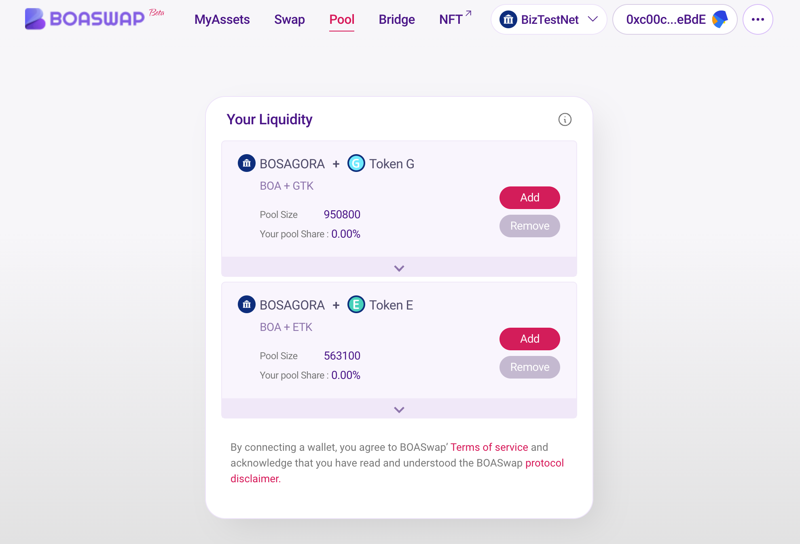

# 유동성

- BOASwap Pool은 BOASwap DEX Protocol을 위한 유동성 풀 입니다.
  각 BOASwap 유동성 Pool은 한쌍의 ERC20 토큰을 위한 거래 장소입니다.
  Pool이 거래를 촉진 하려면 누군가가 각 토큰의 초기 보증금으로 풀에 공급 해야 합니다. 이것은 풀의 초기 가격을 설정 하게 됩니다.
  Pool은 사용자가 기능을 호출하여 운영하는 스마트 계약 이며 유동성을 제공할때 ‘deposit’ 함수를 호출 합니다.

- 다른 유동성 공급자가 기존 풀에 추가할 때 현재 가격에 비례하여 페어 토큰을 예치해야 합니다.
  그렇지 않은 경우 추가한 유동성도 차익 거래될 위험이 있습니다. 현재 가격이 올바르지 않다고 판단되면 원하는 수준으로 차익 거래를 하고 해당 가격에 유동성을 추가할 수 있습니다.

  
