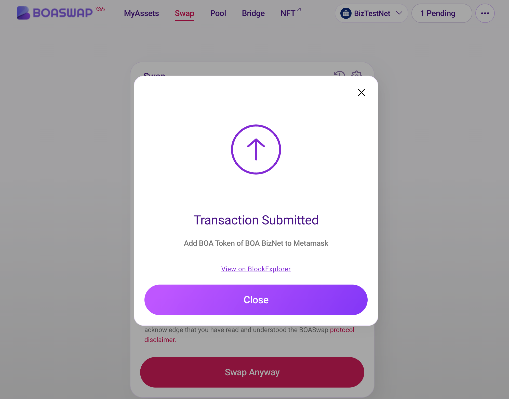

# BOASwap 사용하기

[BOASwap Swap](https://testnet.boaswap.io/#/swap)에 크롬 브라우저를 이용해서 접속 합니다.

BOASwap을 사용하기 전에 MetaMask(Wallet)가 설치 되어 연결 되어 있어야 합니다.
BOASwap에서 BOSAGORA BizNet BOA를 ETK(Demo Token)로 교환하는 시나리오를 설명 하겠습니다.
현재 스크린샷의 이미지는 BizTestNet의 상황 입니다. 실제 실행은 BizNet에서 실행 해야 합니다.

* 먼저 네트워크가 BizNet으로 선택 되어 연결 되어 있는지을 확인 합니다. 
* 필요사항은 BizNet의 BOA가 필요 합니다.
* 진행과정은 UNISwap의 사용경험과 유사 합니다.

* 먼저 교환할 대상의 토큰을 선택 합니다.
* 토큰의 교환 가능여부는 각 토큰 과 포인트 마다 다를 수 있습니다. 교환이 불가능한 토큰은 비활성화 처리 됩니다.

* 교환할 금액을 입력합니다. 상단에서 입력토큰 금액수량을 입력 하면 BOASwap DEX Protocol의 유동성 가격 곡선의 에 의해서 받을 토큰 수량이 정해 집니다.
* 수수료는 1.5% 로 측정 되어 있으며 이것은 유동성 공급자 수수료 와 프로토콜 수수료의 합 입니다.
* 스왑 실행시에는 Approve가 실행되며 스왑 실행에는 네트워크 가스비가 소량 필요합니다.

* 설정 팝업 에서는 Slippage Tolerance와 Transaction deadline 을 설정 할 수 있습니다.
* Slippage Tolerance은 예상 출력과 거래 실행시점의 실제 출력간의 차이를 나타냅니다. 가격이 설정된 Slippage 한도 이상으로 변경되면 거래가 취소 됩니다. 
* Transaction deadline은 사용자가 상당한 가격 변동 후에 나쁜 가격으로 거래를 실행하는 것을 방지하기 위해 기본 거래 마감을 20분으로 설정합니다.
* 가스 가격이 충분히 높게 설정되지 않은 경우 거래가 deadline에 도달할 수 있습니다.

* 거래 내역을 다시 확인 입니다. 교환될 토큰의 수량을 확인하십시요.
* Price Impact는 이 거래가 거래 쌍의 시장가격에 미치는 영향을 나타냅니다.
* 확인이 끝나면 "Swap Anyway"를 클릭 하여 스왑을 실행 합니다.

* 월렛 에서 스왑 트랜잭션을 의 가스요금을 확인하고 "확인" 버튼을 눌러 트랜잭션을 전송 합니다.

* 트랜잭션이 제출 되었습니다. "Close" 를 클릭하여 팝업을 닫습니다.

* 오른쪽 상단에서 스왑 결과 를 메세지로 확인 할 수 있습니다.

* 자신이 스왑한 대상의 토큰 잔액을 My Assets 메뉴에서 확인 할 수 있습니다.

